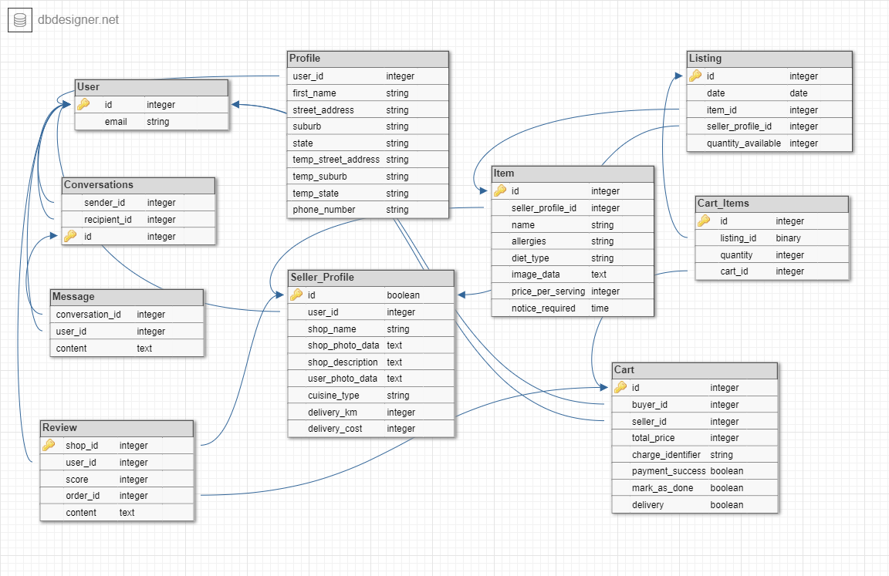
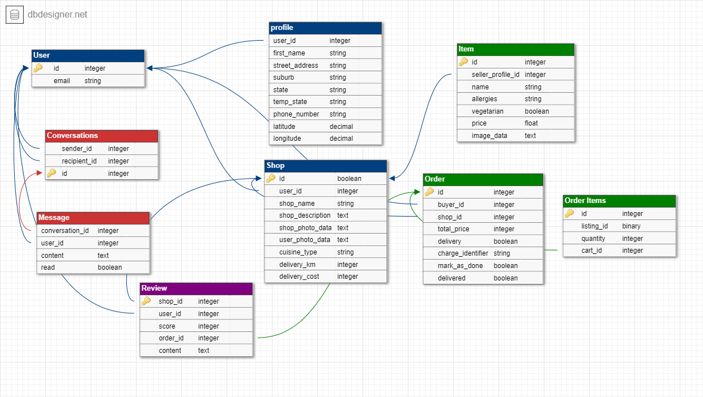
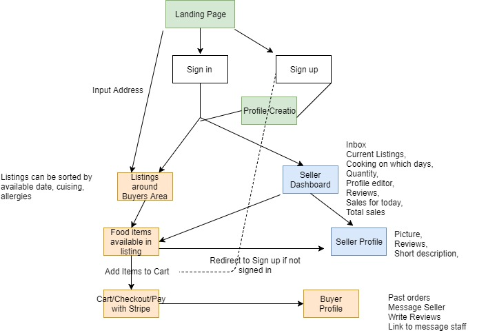

# Lobster

Lobster is a 2 sided marketplace that fatilitates the exchange home cooked meals for payment.

It allows people to purchase from home cooks from around their local area. It also enables local cooking enthusiasts to do what they love as well as earn a small living like Uber. 

This was a 2-sided marketplace assignment for the bootcamp @ CoderAcademy

## Problem
People this day and age are eating out as they are busier and have less time for cooking at home. There is no doubt that takeaway/resturant food is not as healthy as a home cooked meal. They may be seeking an alternative form of food delivery/take away which allows them to "have their cake and eat it too."

There are a lot of good home cooks out there, each whom specialise in whatever they create whether it be pasta, stews, cakes or curry. This is especially the case in Melbourne where there so much ethnic diversity and there is no doubt that the best and most authentic versions of food come people's homes.

This idea was inspired by my experiences. There are a lot of excellent vietnamese home chefs in my area who my mother has purchased food from. The food was always been clean, and tasty and unlike anything that I've had at restaurants. She always found out about these home cooks through word of mouth and it would be great for myself to have the ability to 

## Solution
Lobster is an app that connects those seeking a healthier option to takeaway or eating out with those who want to express their talents or want to earn an income of money through cooking. It allows customers to see the foods available to them that day in their area, order and purchase it with the option of delivery or pickup.

It allows chefs to keep track of their orders, and receive payments from people who purchase from them. They can set up a listing or a "shop" like Etsy and gives them the flexibility to work when they want "like Uber". It allows the chefs to decide whether they offer delivery or whether they would prefer to allow pickups or both. There is a review system that can be used for self-improvement and information for buyer's purchases.

It is an income generating platform where the application will take a commission of each purchase.

## User Stories
#### Some but not limited to:

    In order to decide on which listing I want, as a buyer, I want to see each listing with distance, food type, pickup/delivery options, and food items available.

    In order to ensure that I am receiving quality food, as a consumer, I want see reviews of the seller I am purchasing from.

    In order to stay alive, as a buyer with allergies, I want to see the ingredients of each food item.

    In order to showcase my food, as a seller, include a title, short description, delivery/pickup and image for my listings.

    In order to make money, as a seller, I want to be able to set the price of my items and delivery costs.

    In order to achieve flexibility, as a seller, I want to be able to choose to work when I want to.

    In order to dynamically list food for the day, as a seller, I want to be able to plan what I serve each day of the week.

Target Markets:
| Sellers       | Buyers        |
| ------------- |---------------|
| Homemake who wants to earn an extra income    | Time concious indivduals and families |
| Those who want to take advantage of the economies of scale  | People concerned about their health      |
| Hobby or Aspring Bakers | People who want explore the culinary delights       |
| Aspring chefs, aspring resturanters | Those who want an alternative to take-way or restuarant food      |

## ERD
(original plan)

(Actual ERD)

## Workflow Diagram

## Wireframes

## Issues & Learnings

* Biggest issue was to have forms nested within forms in the order page to return a nested hash param. This was done to allow different items of differing quantities to be added to the order at the one time in order to create Items and OrderItems at the same time.

* Issues figuring out how to do the search and filter bars and how to return certain params in the correct way. Had a few problems joining them together as the search function(button) returns a blank param if nothing is selected for [:term] or [:filter] (params used for the search and filter) 

* I was not able to implement a time feature: where the seller can select days which they are "cooking" and times when the buyer has to purchase before. This was due to time constraints and difficulty which could be solved with a bit better planning for time management. Prostinated too much during the first week.

* Rspec and getting it to work on Windows was an issue. The load time on the Windows PC is really slow (almost 20s per run) so sometimes it was easier to just test manually. 

* Creating a button that updates the boolean on click: This was a fun experience and suprisingly didn't take up a lot of code.
    <% if order.done? %>
    <%= form_for order do |f| %>
    <%= f.hidden_field :mark_as_done, value: false %>
    <%= f.button :submit, class: "btn btn-primary" do %>
    <%= fa_icon "square" %>
    <% end %>
    <% end %>
    <% else %>
    <%= form_for order do |f| %>
    <%= f.hidden_field :mark_as_done, value: true %>
    <%= f.button :submit, class: "btn btn-red" do %>
    <%= fa_icon "check-square" %>
    <% end %>
    <% end %>
    <% end %>

## Links
Trello: https://trello.com/b/CtWn4Zgo/2-sided-marketplace
Figma: https://www.figma.com/file/RcRvDgBBLFubxodgMhlXPWsH/Rails-2-sided-marketplace
ERD: http://dbdesigner.net/designer/schema/122923

## Gems
* Dotenv
* Geocoder (was useful to work out distance between 2 coordinates)
* Devise
* Bootstrap and dependencies
* Font Awesome (they have awesome icons)
* Stripe
* Shrine and dependencies
* AWS-k